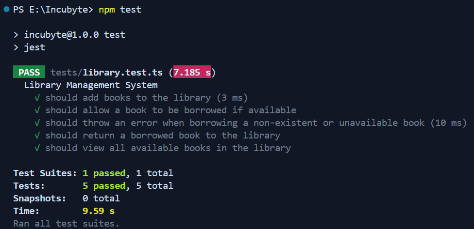

# Library Management System
This is a simple Library Management System that allows users to:
- Add books to the library.
- Borrow books (if available).
- Return borrowed books.
- View all available books.

The project is built using **TypeScript** and follows a **Test-Driven Development (TDD)** approach using **Jest** for testing.

## Features

1. **Add Books**: Add a book with unique details like ISBN, title, author, and publication year.
2. **Borrow Books**: Borrow a book if it’s available.
3. **Return Books**: Return a borrowed book and make it available again.
4. **View Available Books**: View a list of all available books in the library.

## Classes and Attributes

### 1. **`Book` Class**
Represents a book in the library.

- **Attributes**:
  - `isbn` (string): Unique identifier for the book (e.g., ISBN).
  - `title` (string): Title of the book.
  - `author` (string): Author of the book.
  - `publicationYear` (number): Year the book was published.
  - `available` (boolean): Indicates whether the book is available for borrowing or not.

### 2. **`Library` Class**
Manages the library operations like adding, borrowing, returning, and viewing books.

- **Attributes**:
  - `books` (Book[]): An array that holds the collection of books in the library.

- **Methods**:
  - `addBook(book: Book)`: Adds a new book to the library.
  - `borrowBook(isbn: string)`: Allows borrowing a book by its ISBN if it's available.
  - `returnBook(isbn: string)`: Returns a borrowed book to the library.
  - `getAvailableBooks()`: Retrieves a list of all available books in the library.

## Setup Instructions
- ```git clone https://github.com/ompanchwate/incubyte_assessment.git```
- ```cd incubyte_assessment```
- ```npm i``` to install all the dependencies
- Run ```npm test``` to test the application

## Test Cases
### 1. Add Books: 
- Ensures that when a book is added to the library, it gets stored in the available books collection, and the count of available books increases.

### 2. Borrow Available Book: 
- Verifies that a book can be successfully borrowed if it is available, and it gets removed from the list of available books.
### 3. Borrow Unavailable/Non-Existent Book: 
- Checks that the system throws an appropriate error ('Book not available') when attempting to borrow a book that either doesn't exist or has already been borrowed.
### 4. Return Borrowed Book: 
- Ensures that a borrowed book can be returned to the library, and once returned, it appears again in the available books list.
### 5. View Available Books: 
- Confirms that the library correctly lists all available books when multiple books are added.

## Test Results
